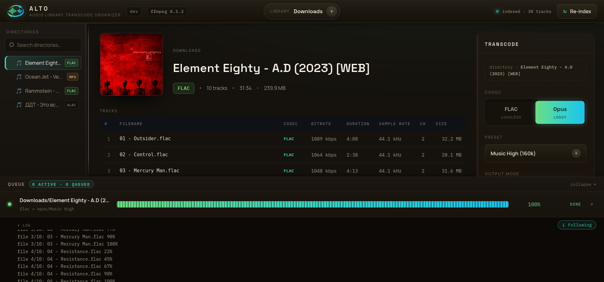

# ALTO — Audio Library Transcode Organizer


ALTO is a self-hosted web UI for **converting your music library to another audio format** — without touching the command line.

Point it at the folders where your music lives, open it in a browser, click through to an album, pick a format, and press Transcode. ffmpeg does the work on the server; you watch the progress bar. Nothing is uploaded anywhere and nothing leaves your machine.



## What it's for

Typical reasons people run ALTO:

- **Shrink a lossless collection for a phone or a car.** A FLAC library converted to Opus at 160k is roughly a fifth of the size and still transparent to the ear. Keep the originals, put the Opus copy on the device.
- **Normalize a messy library to one format.** Downloads arrive as a mix of WAV, ALAC, high-bitrate MP3. Convert a directory tree to a single consistent format in one pass.
- **Re-encode in place, safely.** Replace mode rewrites files where they sit — atomically, one file at a time, with an automatic rollback if ffmpeg fails, so a bad run can't shred your library.
- **See what's actually in your library.** ALTO probes every file and shows codec, bitrate, sample rate, channels, and duration — so you can find the 320k MP3s hiding among the FLACs before deciding what to convert.

## Features

### Browsing your library

- Directory-tree browser over any number of mounted libraries, with a library switcher showing per-library track counts and index status.
- Every audio file is probed with `ffprobe` and indexed into SQLite: codec, bitrate, duration, sample rate, channels — visible per track without opening a player.
- Re-indexing is incremental: a file is re-probed only when its size or modification time changed, so a rescan of an unchanged library is a directory walk rather than a full `ffprobe` pass over the collection.
- Cover art is shown for each directory, both from external files (`cover.jpg` and friends) and extracted from embedded tags.
- Server-side search jumps straight to a directory by name instead of clicking down the tree.

### Transcoding

- **Two output formats**: FLAC (lossless, for archiving) and Opus (lossy, for devices).
- **Presets** for both, so you don't need to know ffmpeg flags — Fast / Balanced / Max Compression for FLAC, 128k / 160k / 192k for Opus. See [Transcoding Presets](#transcoding-presets).
- **Custom mode** for when you do: set bitrate or compression level directly, toggle metadata and cover-art copying, or pass raw ffmpeg arguments.
- **Three output modes** — write to a shared output directory, drop an `.alto-out/` folder next to the source, or replace the originals in place with rollback. See [Output Modes](#output-modes).
- **A job queue** with a configurable number of parallel workers (`ALTO_TRANSCODE_WORKERS`). Queue a dozen albums and walk away; jobs beyond capacity wait their turn, and the queue panel — visible on every screen — lets you watch or cancel any of them.
- **Mixed albums**, where lossless and lossy tracks sit in one directory, are handled per track: tick *Skip lossy* (or pick tracks by hand) and ALTO transcodes the lossless ones and leaves the rest alone. Optionally the skipped files are copied verbatim into the output, so what lands there is still a complete album. See [Mixed Directories](#mixed-directories).
- **Live progress**, streamed over SSE for both transcoding and library re-indexing. No page refreshing to find out where it's at.

### Deployment

- One Docker image with ffmpeg baked in — no separate ffmpeg install, no build step.
- SQLite index in WAL mode; no external database to run alongside it.
- Works on a phone or tablet as well as a desktop: the tree collapses into a drawer, the transcode panel becomes a slide-in sheet, and a floating Transcode button opens it.

## Quick Start

ALTO ships as a single Docker image. You need [Docker](https://docs.docker.com/get-docker/)
with Compose. The repository's [`docker-compose.yml`](docker-compose.yml) pulls a
published image and is driven entirely by a `.env` file:

```sh
cp .env.example .env       # set image/tag, host port, and your library paths
docker compose up -d
```

Then open **http://localhost:8080** (or whatever `ALTO_HTTP_PORT` you set).

`.env` maps your host directories into the container and lists them in
`ALTO_LIBRARIES`; see the [Configuration](#configuration) table below and the
comments in [`.env.example`](.env.example). Your SQLite index and cover-art cache
persist in the `alto_data` Docker volume, so they survive restarts and upgrades.

> **Read-only mounts** (`:ro`, the default in `docker-compose.yml`) are only safe
> with **Shared `/out`** output mode. The **Local `.alto-out/`** and **Replace**
> modes write into the source directory and need a writable library mount — drop
> the `:ro` for those.

## Configuration

All configuration is via environment variables.

| Variable | Default | Description |
|---|---|---|
| `ALTO_LIBRARIES` | (required) | Comma-separated `name:path` pairs, e.g. `Music:/music,Lossless:/lossless`. Names must match `[a-zA-Z0-9_-]`. |
| `ALTO_PORT` | `8080` | HTTP server port |
| `ALTO_OUTPUT_DIR` | `/out` | Shared output directory for transcoded files (Shared /out mode) |
| `ALTO_DB_PATH` | `./alto.db` | SQLite database file path |
| `ALTO_CACHE_DIR` | `./cache` | App-managed cache for extracted cover art — keep separate from library mounts |
| `ALTO_TRANSCODE_WORKERS` | `1` | Number of concurrent transcode jobs; additional jobs sit `queued` until a worker is free |
| `ALTO_SCAN_ON_START` | `true` | Re-index libraries at startup. Scanning is incremental, so a restart normally only walks and `stat`s the tree; set to `false` to skip even that — on very large or slow mounts, or to keep the one full re-probe after an upgrade out of boot. The UI's re-index button and `POST /api/scan` are unaffected. Accepts `true`/`false` or `1`/`0`; any other value is a fatal startup error |
| `ALTO_SCAN_WORKERS` | `0` (auto) | Maximum concurrent `ffprobe` processes during a scan, across all libraries. `0` picks the built-in default, `min(4, NumCPU)` |

## Running It

The [`Makefile`](Makefile) wraps the common operator actions (all read `.env`):

```sh
make up       # start the stack
make down     # stop and remove it
make logs     # tail the logs
make ps       # container status
make pull     # pull a newer image tag
make restart  # recreate the stack
```

### Choosing an image

`ALTO_IMAGE` / `ALTO_TAG` in `.env` select what runs. Pin `ALTO_TAG` to a release
(e.g. `0.1.0`) in production; `latest` is fine for trying it out. Available images:

| Registry | Image |
|---|---|
| Docker Hub | `semsemyonoff/alto` |
| GHCR | `ghcr.io/semsemyonoff/alto` |

### Upgrading

Bump `ALTO_TAG` in `.env`, then:

```sh
make pull && make up
```

The SQLite schema migrates in place — no action needed. The first scan after an
upgrade that adds the incremental-scan cache re-probes the whole library once
(the cache starts empty); later re-indexes are near-instant.

## Transcoding Presets

### FLAC

All FLAC presets: metadata copy on, cover art copy on, verify on.

| Preset | Compression Level | Notes |
|---|---|---|
| Fast | 0 | Fastest encode, largest file |
| Balanced (default) | 5 | Good balance of speed and size |
| Max Compression | 8 | Slowest, smallest file |

### Opus

All Opus presets: VBR on, application=audio, compression_level=10, source channel layout preserved.

| Preset | Bitrate | Notes |
|---|---|---|
| Music Balanced | 128k | Transparent for most content |
| Music High (default) | 160k | Recommended default |
| Archive Lossy | 192k | High-quality archive |

### Custom Parameters

Select "Custom" in the preset dropdown to configure manually:

- Bitrate (Opus) or compression level (FLAC)
- Metadata copy flag
- Cover art copy flag
- Additional raw ffmpeg arguments (advanced)

## Output Modes

| Mode | Description |
|---|---|
| Shared /out (default) | Mirrors library path structure under `<ALTO_OUTPUT_DIR>/<library-name>/<relative-path>/`. Non-audio files copied alongside. |
| Local out | Creates `.alto-out/` subdirectory inside the source audio directory. |
| Replace | Atomic per-file in-place replacement with rollback. Backup created on same filesystem; restored automatically on failure. Requires confirmation. |

## Mixed Directories

By default ALTO refuses a directory that is not entirely lossless. That is
deliberate: transcoding an MP3 to Opus would produce a second generation of lossy
encoding, quietly worse than what you started with.

A *mixed album* — a release padded with singles, a compilation, a session partly
re-released later — is handled per track instead. Open such a directory and the
transcode panel offers:

- **Skip lossy (N)** — transcode every lossless track and leave the lossy ones
  untouched. It is pre-selected for a mixed directory, so a mixed album is still a
  one-click START.
- **Per-track checkboxes** — pick an explicit subset. Lossy rows are marked and
  their checkbox is disabled; they can never be selected as a source.
- **Copy skipped to output** — copy the skipped files byte-for-byte into the
  output directory, so what lands there is a complete album rather than one with
  holes in the tracklist. Not available in Replace mode, where the originals are
  already in place.

The source files are never modified by any of this: skipped tracks are read at
most, and only when you asked for them to be copied.

## HTTP API

Everything the UI does is available as JSON over HTTP — enough to drive ALTO from
a script or a download-automation pipeline. Errors carry a stable machine-readable
code, so a client never has to match on message text.

### Endpoints

| Endpoint | Purpose |
|---|---|
| `GET /api/libraries` | Configured libraries with track counts and index status |
| `GET /api/tree/{libraryID}` | Directory tree for a library |
| `GET /api/dir?path=` | One directory plus its indexed tracks |
| `GET /api/cover?path=` | Cover art for a directory |
| `GET /api/presets` | Every built-in preset and the codecs they target |
| `POST /api/transcode` | Start a job — see below |
| `GET /api/jobs` | Queue listing (queue order) |
| `GET /api/jobs/{id}` | Full detail for one job, including failure reason and output directory |
| `GET /api/jobs/events` | SSE stream of job updates |
| `POST /api/jobs/{id}/cancel` | Cancel a queued or running job |
| `POST /api/jobs/{id}/remove` | Drop a terminal job from the queue listing |
| `GET /api/transcode/{jobID}/log[?n=N]` | Per-job ffmpeg log; `n` tails the last N lines |
| `POST /api/scan[?library_id=N]` | Start a re-index, asynchronously — every library, or one by id |
| `GET /api/scan/state` | `{running, started_at}` for the full scan |
| `GET /api/scan/status` | SSE stream of full-scan progress |
| `POST /api/scan/dir?path=` | Index exactly one directory, synchronously |
| `GET /api/version` | Build version |

### Starting a job

```jsonc
POST /api/transcode
{
  "path": "/music/Some Artist/Some Album",
  "codec": "opus",                // "flac" or "opus"
  "preset": "Music High",
  "output_mode": "shared",        // "shared", "local", "replace"

  "skip_lossy": true,             // optional — transcode the lossless tracks only
  "files": ["01 A.flac"],         // optional — an explicit selection
  "copy_skipped": false           // optional — copy unselected audio verbatim
}
```

`skip_lossy` and `files` are two ways to say the same thing and are mutually
exclusive; sending both, or an empty `files: []`, is a `400 invalid_request`.
`files` accepts lossless names only — it narrows a job, it never widens it — and
every name must be a bare filename present in the directory index.

With neither field, behaviour is exactly what it always was: an all-lossless
directory transcodes in full, and a mixed one is refused with
`422 mixed_directory`.

| input | directory | result |
|---|---|---|
| neither | all lossless | transcodes everything |
| neither | mixed | `422 mixed_directory` |
| neither | all lossy | `422 mixed_directory` |
| `skip_lossy` | mixed | transcodes the lossless tracks only |
| `skip_lossy` | all lossy | `422 no_lossless_tracks` |
| `files` | any | transcodes exactly the listed names |

`mixed_directory` says only "not every track here is lossless", so an all-lossy
directory with no selection gets it too. `no_lossless_tracks` is reserved for
`skip_lossy` finding nothing left to do.

In `output_mode: "replace"` the unselected tracks stay where they are, and that
directory is also the destination — so a job whose output would land on one of
them is refused with `422 output_name_conflict` rather than overwriting it.

A successful call answers `202` naming both halves of the resolved selection, so
a client learns what was scheduled and what was left alone without a second
request:

```jsonc
202 {
  "job_id": "a1b2c3d4",
  "files":   ["01 A.flac", "02 B.flac"],
  "skipped": [{"name": "03 C.mp3", "codec": "mp3", "reason": "lossy"}]
}
```

`reason` is `lossy` (dropped by `skip_lossy`) or `not_selected` (absent from
`files`).

### Following a job

```jsonc
GET /api/jobs/{id}
200 {
  "id": "a1b2c3d4",
  "status": "done",               // queued | running | done | failed | canceled
  "pct": 100,
  "title": "Music/Some Artist/Some Album",
  "sub": "flac → opus/Music High",
  "dir": "/music/Some Artist/Some Album",
  "error": "",                    // populated only when status is "failed"
  "output_dir": "/out/Music/Some Artist/Some Album",
  "files":   ["01 A.flac", "02 B.flac"],
  "skipped": [{"name": "03 C.mp3", "codec": "mp3", "reason": "lossy"}],
  "total_files": 2,
  "done_files": 2,
  "created_at":  "2026-08-10T12:00:00Z",
  "started_at":  "2026-08-10T12:00:01Z",   // null until a worker picks it up
  "finished_at": "2026-08-10T12:01:30Z",   // null until it reaches a terminal state
  "evicted": false
}
```

A terminal job stays answerable here long after it leaves `GET /api/jobs`:
half an hour after finishing it is tombstoned, which sets `evicted: true` and
drops it from the queue listing and the event stream while this endpoint keeps
reporting its outcome. So `404 job_not_found` means the id never existed, not
"you polled too late". Tombstones are dropped for real only once more than 256
of them accumulate, oldest first.

### Errors

Every JSON endpoint answers a failure with the same envelope, optionally carrying
context:

```jsonc
422 {
  "error": "file is not a lossless source: 03 C.mp3",
  "code": "lossy_source_selected",
  "lossy": ["03 C.mp3"]
}
```

Codes: `invalid_request`, `path_forbidden`, `path_not_found`,
`library_not_found`, `not_indexed`, `no_tracks`, `mixed_directory`,
`no_lossless_tracks`, `unknown_file`, `lossy_source_selected`,
`output_dir_not_configured`, `output_name_conflict`,
`copy_skipped_not_applicable`, `engine_unavailable`, `job_already_running`,
`job_already_finished`, `job_not_found`, `scan_running`, `no_cover`,
`internal_error`.

`path_not_found` and `not_indexed` are deliberately distinct: the first means the
path is absent from the filesystem (a typo — rescanning will not help), the
second that it exists but ALTO has not indexed it yet.

### Transcoding a fresh download

That distinction is what makes the two-call flow work on a directory ALTO has
never seen — no full re-index, no event stream to parse:

```sh
curl -X POST 'http://localhost:8080/api/scan/dir?path=/music/New%20Album'
curl -X POST http://localhost:8080/api/transcode \
  -H 'Content-Type: application/json' \
  -d '{"path":"/music/New Album","codec":"opus","preset":"Music High",
       "output_mode":"shared","skip_lossy":true,"copy_skipped":true}'
```

`POST /api/scan/dir` indexes one directory synchronously and returns it with its
tracks. It is mutually exclusive with a full scan in both directions: it answers
`409 scan_running` while one is in flight, and `POST /api/scan` is refused while a
single-directory index is running.
